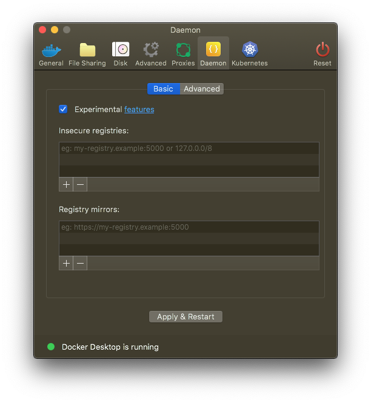

# vagrant-docker-osx

This is the equivalent of a vagrant base box for vagrant's docker
provider. Since it runs in a hypervisor it may be faster than
solutions like VirtualBox that emulate the entire machine.

Tested in Docker Desktop on OSX.

This also demonstrates building a yum cache in one stage of a multistage
build, then installing from that cache in another stage, avoiding both network
traffic and bloat in the final image.

Tested on Docker Engine 19.03.4.

To use, enable experimental features in your docker, and/or export DOCKER_BUILDKIT=1.<br>


Then run build almost as usual:
```
$ docker build .
```

## Project setup
```
$ vagrant up --provider=docker
```
